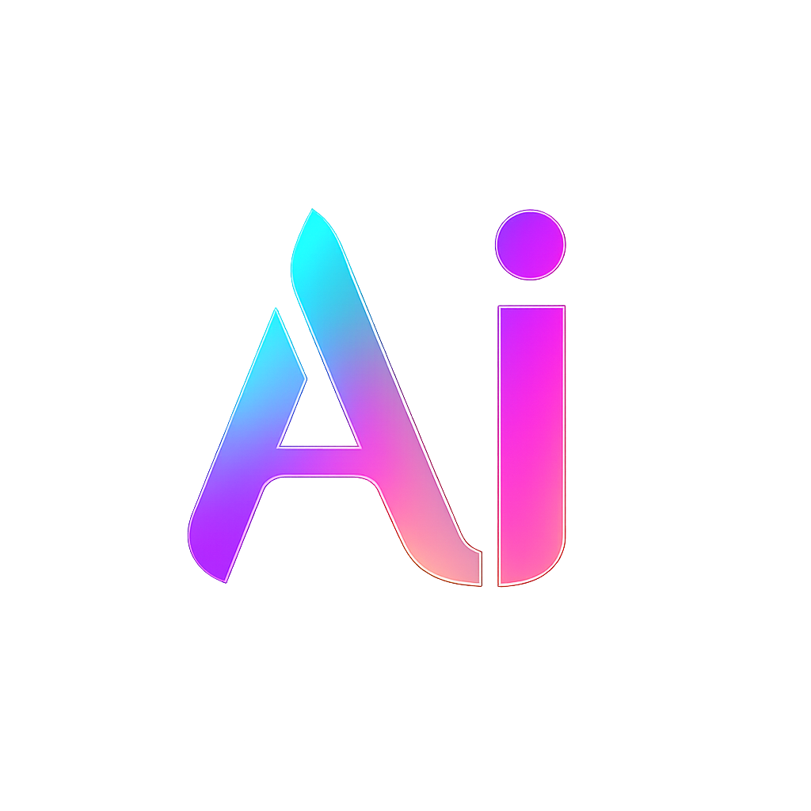
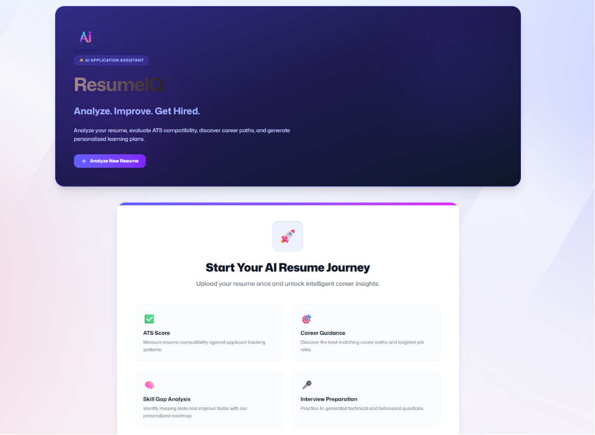
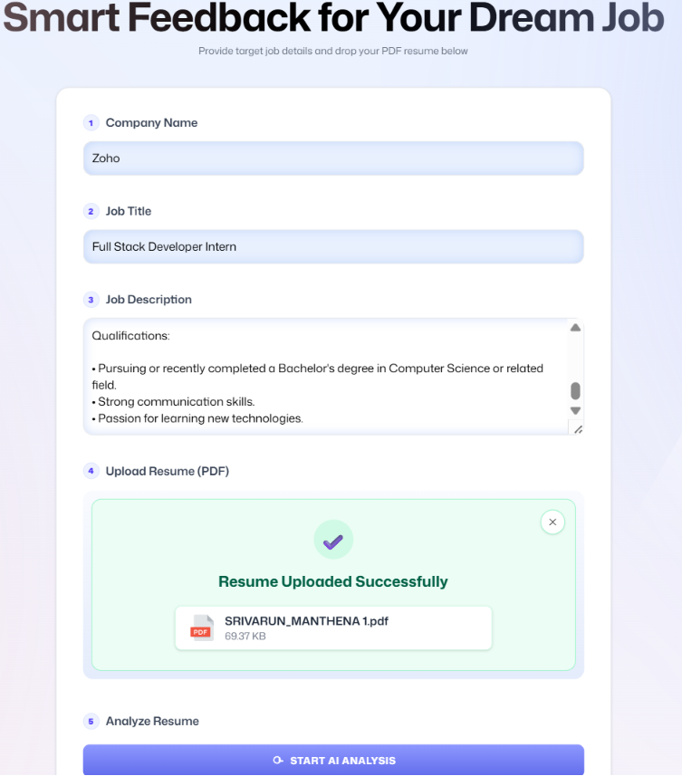
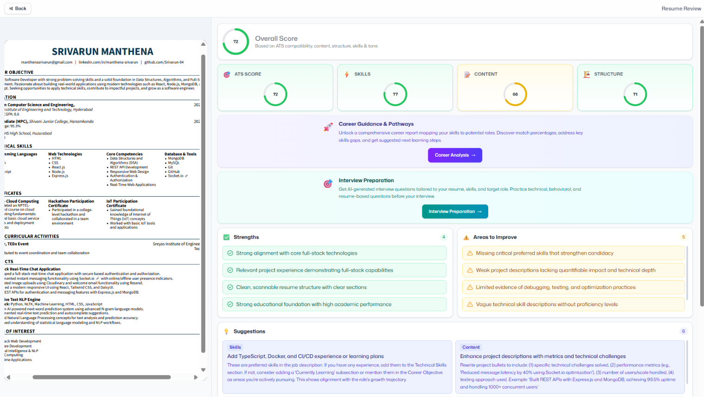
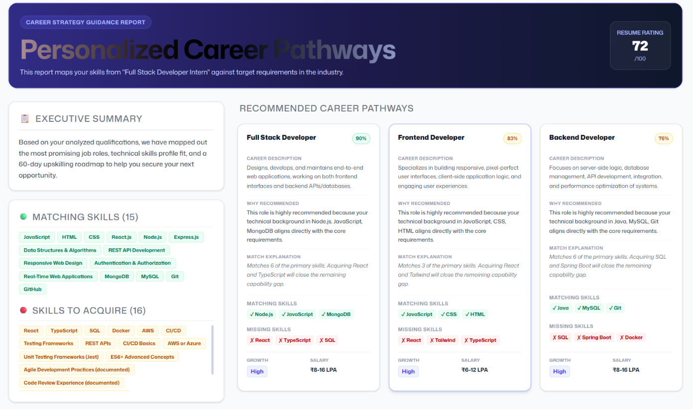
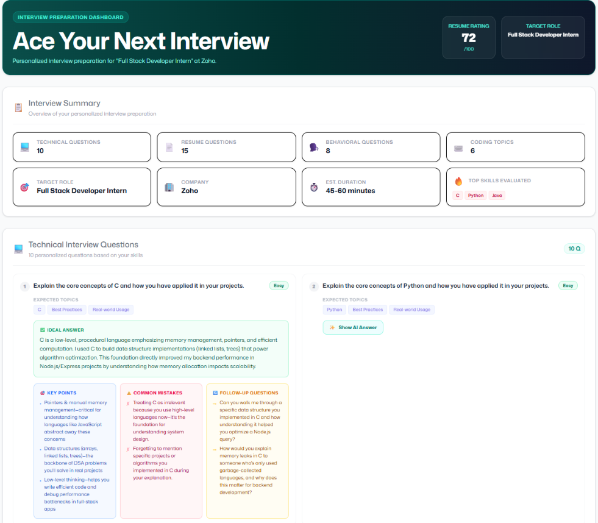
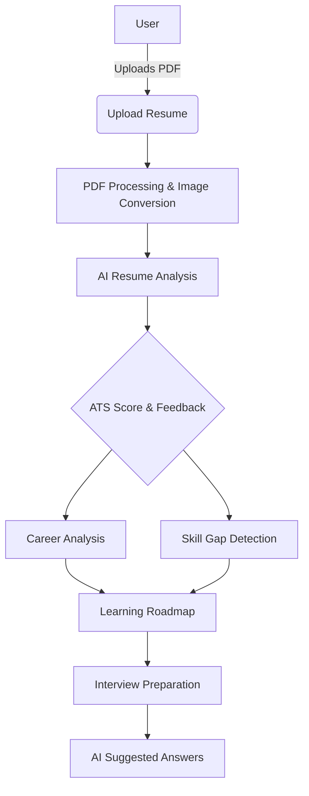

<div align="center">
  
  <h1>ResumeIQ</h1>
  <h3>Analyze. Improve. Get Hired.</h3>
  <p>An AI-powered Resume & Career Analyzer built to accelerate your career growth.</p>
</div>

---

## 📖 Overview

**ResumeIQ** is an advanced, AI-driven platform designed to help job seekers optimize their resumes, navigate applicant tracking systems (ATS), and prepare for interviews. By leveraging cutting-edge AI, ResumeIQ provides deep, actionable insights into your professional profile, seamlessly extracting skills, identifying critical gaps, and paving a personalized roadmap to land your dream role.

---

## ✨ Features

- **📄 Resume Upload & PDF Preview:** Seamlessly upload and instantly preview your resume in a clean, modern interface.
- **🤖 AI Resume Analysis:** Receive deep, AI-driven feedback on your resume's content, structure, and tone.
- **📊 ATS Score:** Get a comprehensive Applicant Tracking System compatibility score.
- **💡 Improvement Suggestions:** Actionable, tailored advice to fix weaknesses and highlight strengths.
- **🎯 Career Path Recommendation:** Discover suitable roles tailored exactly to your extracted skill set.
- **🧠 Skill Extraction:** Automatically identify and categorize your technical and soft skills.
- **📈 Skill Gap Analysis:** Compare your current skills against industry requirements for your target role.
- **🗺️ Personalized Learning Roadmap:** Step-by-step 30, 60, and 90-day upskilling plans.
- **🎤 AI Interview Preparation:** Practice with dynamic questions based strictly on your resume and target job.
- **💬 Technical Questions:** Challenge your technical depth.
- **📚 Resume-Based Questions:** Defend your project decisions and past experiences.
- **👥 Behavioral Questions:** Practice the STAR method for leadership and teamwork scenarios.
- **✨ AI Suggested Interview Answers:** Get ideal model answers, key points, and common mistakes to avoid.

---

## 📸 Screenshots

| Home Page | Upload Resume |
| :---: | :---: |
|  |  |

| Resume Analysis | Career Analysis |
| :---: | :---: |
|  |  |

| Interview Preparation |
| :---: |
|  |

---

## 🏗️ System Architecture



---

## 💻 Tech Stack

| Category | Technologies |
| --- | --- |
| **Frontend** | React, TypeScript, Tailwind CSS, React Router, Vite |
| **AI Services** | Puter AI |
| **Tools & Misc** | PDF.js, Git, GitHub |

---

## 🚀 Installation

Follow these steps to run ResumeIQ locally:

1. **Clone the repository:**
   ```bash
   git clone https://github.com/Srivarun-04/ResumeIQ.git
   cd ResumeIQ
   ```

2. **Install dependencies:**
   ```bash
   npm install
   ```

3. **Start the development server:**
   ```bash
   npm run dev
   ```

---

## 📂 Folder Structure

```text
ResumeIQ/
├── app/
│   ├── components/      # Reusable UI components
│   ├── routes/          # Application pages & routing logic
│   ├── lib/             # Utility functions and store setup
│   ├── root.tsx         # Root component
│   └── app.css          # Global Tailwind styles
├── constants/           # Application constants & AI prompts
├── public/              # Static assets (images, icons)
├── package.json
└── README.md
```

---

## 🔮 Future Enhancements

- **📝 Cover Letter Generator:** Automatically draft cover letters tailored to specific job descriptions.
- **🔄 Resume Version Comparison:** A/B test different resume formats and contents.
- **📥 Resume Export:** Download beautifully formatted, ATS-optimized PDFs.
- **🏢 Company-Specific Interview Prep:** Tailor interview questions for FAANG and other top tech companies.
- **🌍 Multi-Language Support:** Analyze and generate feedback for resumes in different languages.
- **🔐 User Authentication:** Secure user accounts to save and track multiple applications.
- **📊 Dashboard Analytics:** Track application success rates and skill progression over time.

---

## 👨‍💻 Author

Developed by **Srivarun Manthena**

- **GitHub:** [Srivarun-04](https://github.com/Srivarun-04)
- **LinkedIn:** [Your LinkedIn Profile](#) <!-- Replace with actual link -->
- **Portfolio:** [Your Portfolio Website](#) <!-- Replace with actual link -->

---

## 📄 License

This project is licensed under the MIT License. See the [LICENSE](LICENSE) file for details.
